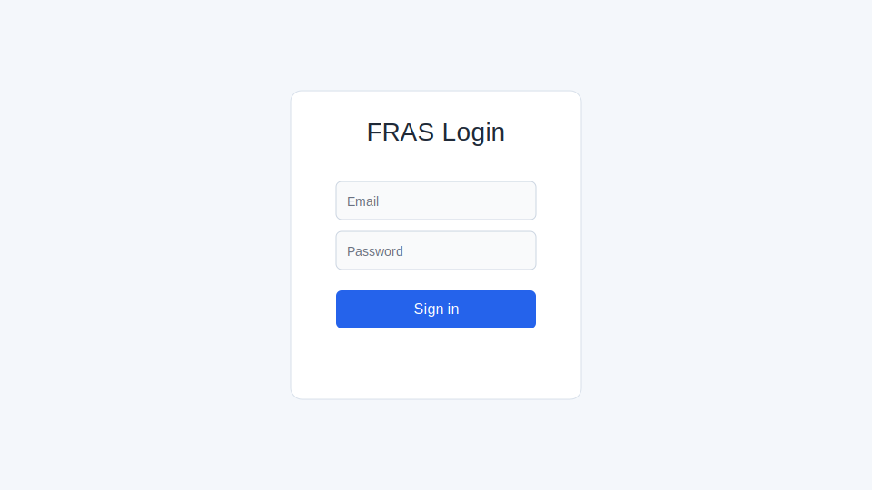
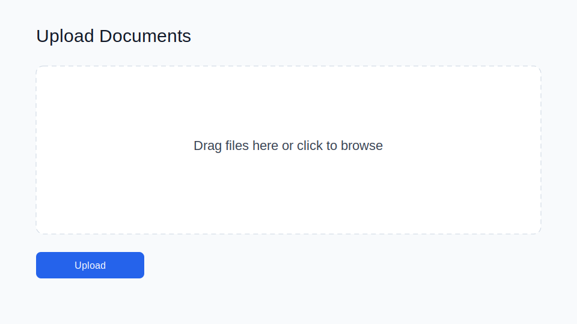
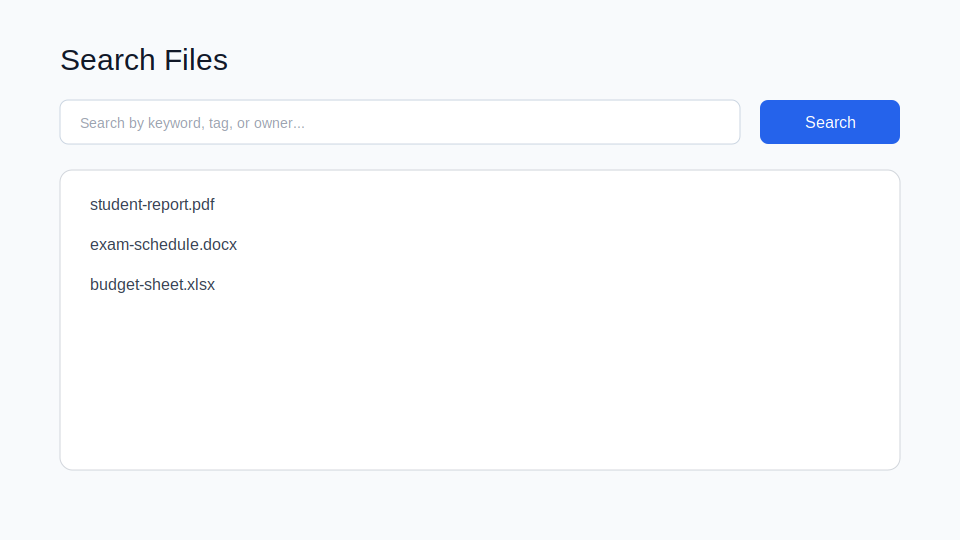
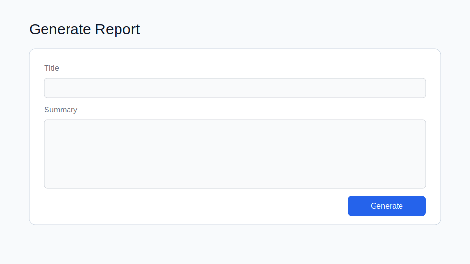

# FRAS User Guide

This guide explains the core user flows: login, upload, search, and report generation.

## 1) Login

1. Open the FRAS login page.
2. Enter your email/username and password.
3. Click **Sign in**.
4. If authentication succeeds, you are redirected to the main dashboard.

## 2) Upload files

1. Navigate to **Upload**.
2. Drag-and-drop files into the upload area, or click to select files.
3. Optional: add tags/metadata if your deployment enables them.
4. Click **Upload** and wait for confirmation.

## 3) Search files

1. Open the **Search** page.
2. Enter keywords (file name, topic, owner, or tags).
3. Click **Search**.
4. Select a result to preview or open the file details.

Tips:
- Use partial keywords for broader matching.
- Combine tags and owner filters (if available) to narrow results.

## 4) Generate report

1. Go to **Reports** or **Generate Report**.
2. Fill in the title and summary/body fields.
3. Select template/output format if required.
4. Click **Generate** to produce the report.
5. Download or store the generated report in FRAS.

## 5) Common issues
- **Cannot sign in:** verify credentials and account status.
- **Upload fails:** check file size/type limits and retry.
- **No search results:** broaden keywords and remove restrictive filters.
- **Report validation error:** complete required fields before generating.
